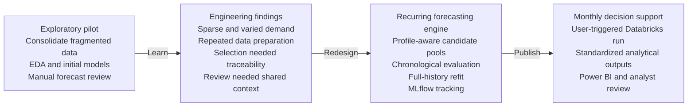
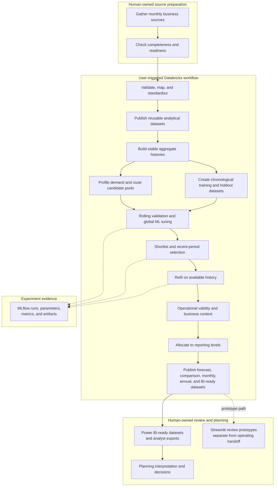
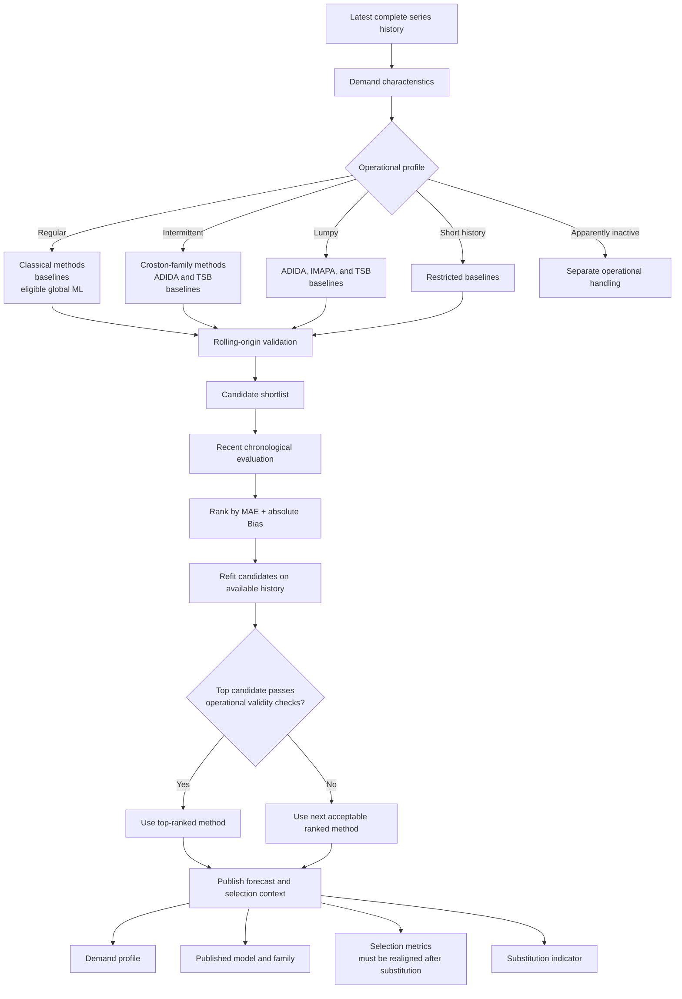
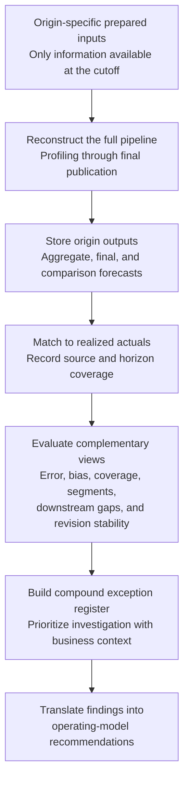

# Architecture and Workflows

These Mermaid definitions are the canonical diagrams supporting the [case-study README](README.md). They are independently created, implementation-informed abstractions. They do not reproduce client architecture, systems, identifiers, schemas, thresholds, data, or results. The README uses synchronized PNG presentation views; their deterministic HTML and CSS sources are kept in [`diagrams/render/`](diagrams/render/).

## 1. Evolution from Pilot to Monthly Decision Support

The first phase established the forecasting baseline and exposed the operating constraints. The second phase converted those findings into a transparent, staged workflow.

This progression is more important than a simple comparison of algorithms. The exploratory work identified data, evaluation, transparency, and operating-model requirements that were then addressed explicitly in the recurring design.

## 2. End-to-End System Architecture

The architecture makes the human-owned boundaries, automated forecasting stages, and one-directional review contract explicit.

Automation began only after the source files were prepared. The pipeline then generated both modeling datasets and reusable analyst-facing information. Power BI and exports remained the adopted handoff; Streamlit represented implemented review prototypes rather than a deployed planning application.

## 3. Transparent Model-Selection Flow

The profile filtered eligible methods. Chronological evidence selected the winner. The published context allowed analysts to understand the result without exposing proprietary implementation details.

The operational profile used the latest complete history because its purpose was to route methods for the next forecast cycle. Training and recent-holdout datasets remained chronologically separated for model fitting and comparison; the holdout target was not used to fit the models. However, the full-history profile restricted candidate eligibility, so the holdout was not completely independent of routing. A hardened selection flow would build the routing profile from training-only history and recompute the operational profile after selection.

In the retrospective study, I reran the full pipeline—including profiling and candidate eligibility—at each historical origin using only inputs available at that cutoff. This reconstructed the completed workflow's decisions at each origin for evaluation.

## 4. Retrospective Portfolio Evaluation

The retrospective study was performed after the recurring workflow had been completed. It reused the complete pipeline at reconstructed point-in-time origins, stored each run's outputs, and evaluated them only when corresponding realized sales volume was available.

Source-level scorecards used the valid rows available for each source. Direct comparisons used matched origin, series, and target-month observations; missing forecast-actual pairs were excluded rather than imputed. Longer-horizon results were interpreted more cautiously because fewer historical origins had corresponding realized actuals. I used this as a completed analytical study; the same framework could later be converted into recurring monitoring.
