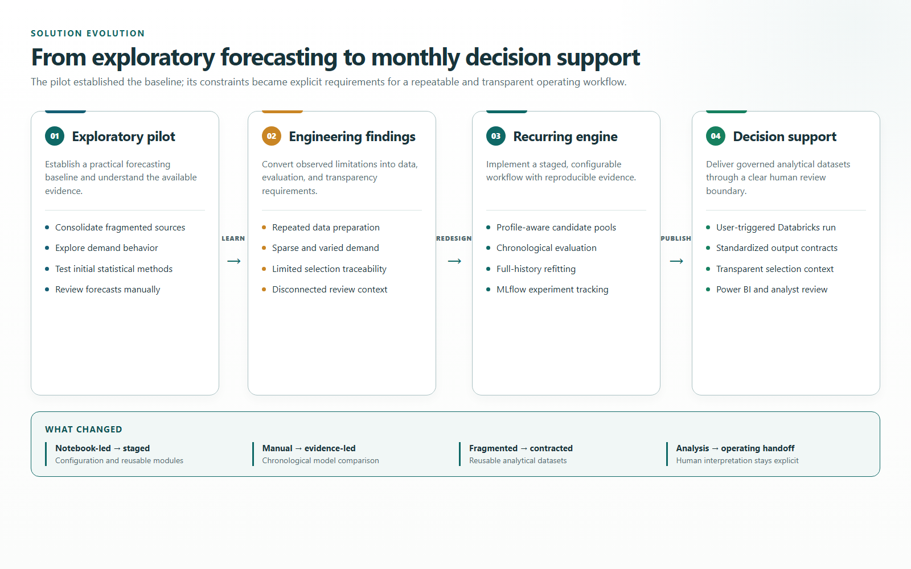
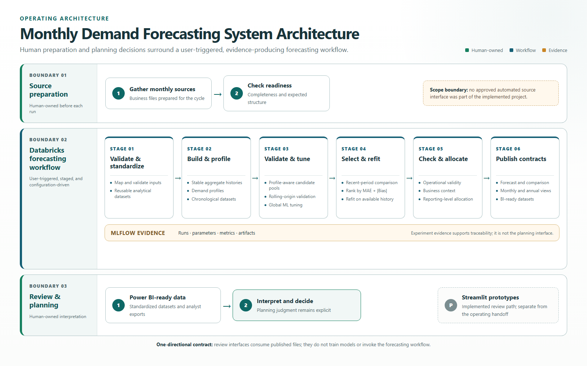
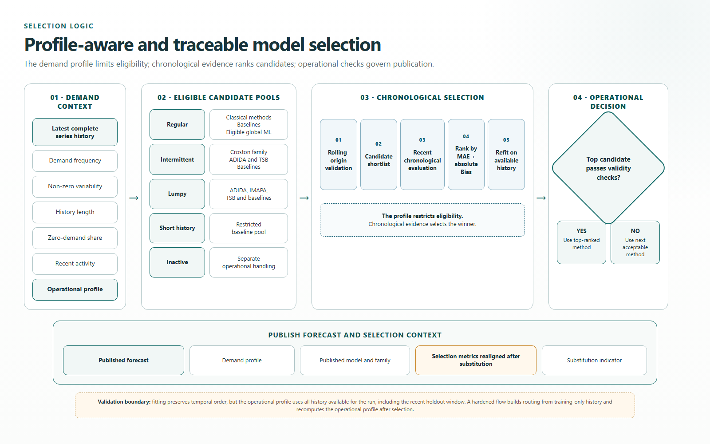

# Demand Forecasting System Design

**From exploratory forecasting to a transparent, repeatable monthly decision-support workflow.**

This repository presents the system-design methodology behind a confidential pharmaceutical demand-planning engagement. Client code and data cannot be shared, so the case study uses independently written diagrams, pseudocode, and technical explanations to document the architecture, evaluation logic, operating model, and engineering lessons.

I designed and built both phases of the engagement as the external technical owner, working with business analysts, analysts, and other stakeholders: an exploratory forecasting pilot and its evolution into a user-triggered monthly forecasting workflow.

## Repository Guide

- **This README:** Business context, solution evolution, implementation scope, and engineering lessons.
- **[Architecture and workflows](ARCHITECTURE.md):** Canonical Mermaid diagrams for the operating architecture, model selection, and retrospective evaluation.
- **[Technical methodology](docs/methodology.md):** Detailed rationale, limitations, trade-offs, and production-hardening priorities.

## 1. Overview

**Role:** External technical owner responsible for the forecasting methodology, Python implementation, workflow design, technical documentation, and handover.

**Operating model:** A user-triggered monthly batch workflow that began after business-owned input files had been prepared and made available in Databricks.

**System scope:** Data standardization and alignment, analytical dataset construction, demand profiling, profile-aware model competition, chronological evaluation, forecast generation, business post-processing, and standardized reporting outputs.

**Technology:** Python, Databricks, MLflow, statistical forecasting, global machine learning, Power BI-ready datasets, and Streamlit prototypes.

**Maturity:** A recurring batch workflow structured for operational use. Real-time serving, scheduled source ingestion, and autonomous planning remained outside the published scope.

## 2. Executive Summary

The central challenge was not simply to train a more accurate forecasting model. Historical demand, portfolio information, planning assumptions, comparison forecasts, and lifecycle events were distributed across separately prepared files. Analysts first had to gather, map, clean, reshape, and reconcile those sources before they could investigate the portfolio or review a forecast.

Trust was a second constraint. Users could receive forecast values without sufficient visibility into the demand pattern, eligible methods, selection criteria, or reasons one model was preferred. Forecasting systems were therefore at risk of being perceived as black boxes.

The solution evolved into a transparent forecasting and data-preparation system that:

- transformed fragmented inputs into comparable monthly histories and reusable analytical datasets
- classified demand behavior before model evaluation
- restricted each series to an appropriate and computationally efficient candidate pool
- evaluated candidates through chronological validation rather than random splits
- exposed the demand profile, selected method, metrics, and override context
- produced standardized forecast, comparison, monthly, annual, and BI-ready outputs
- preserved analyst judgment for business events that historical models could not infer

The intended outcome was a shared, evidence-based baseline that analysts could understand, challenge, and use to focus attention on the exceptions where business context mattered most.

## 3. Planning and Forecasting Challenge

The engagement combined three connected problems.

### 3.1 Fragmented Information

Required information came from multiple business-owned sources with different structures, identifiers, dates, and levels of detail. There was no approved automated source-system interface available within the engagement scope. Users therefore prepared and assembled the monthly source files manually.

The pipeline did more than generate forecasts. It standardized these inputs and published cleaned, aligned datasets that analysts could also use for portfolio analysis, comparison, and reporting.

The modeled target was an observed internal sales-volume measure used as a proxy for demand. It did not represent total market demand, and some external flows and future business events were outside the modeled history. This distinction matters when interpreting both model performance and the role of analyst context.

### 3.2 Heterogeneous Demand

The portfolio contained stable, volatile, intermittent, lumpy, short-history, and inactive series. One model family was not suitable for every pattern, while evaluating every possible method for every series would increase computation and make some winners difficult to defend.

### 3.3 Limited Traceability

Forecast adoption depended on answering practical questions:

- What demand pattern was identified?
- Which methods were allowed to compete?
- How were they evaluated?
- Which method was selected?
- Did a business or validity rule affect the published result?

Making those answers visible became a core system requirement.

## 4. Evolution of the Solution

The exploratory phase consolidated disparate data, examined demand behavior, and tested ARIMA/SARIMA, Prophet, and lag-based regression approaches. Model outputs were reviewed with diagnostics and existing business forecasts, with manual series-level choices or blends used where appropriate.

The pilot exposed the constraints that shaped the recurring workflow: sparse demand required specialized treatment; data preparation was a substantial part of the problem; model selection needed repeatable evidence; and analysts needed visibility into how the result had been generated.

The second phase replaced much of the notebook-driven selection process with a configurable staged pipeline, profile-specific candidate pools, rolling validation, recent-period selection, full-history refitting, MLflow tracking, and standardized handoff datasets.

## 5. Monthly Operating Model

The workflow was deliberately user-triggered. Each cycle followed this operating boundary:

1. Business users assembled and checked the required source files.
2. Prepared inputs were placed in the agreed Databricks location.
3. A user manually triggered the staged forecasting pipeline.
4. The pipeline validated, standardized, modeled, and published the outputs.
5. Analysts reviewed the resulting forecast and comparison datasets and refreshed Power BI.
6. Final planning interpretation and decisions remained human-owned.

Manual triggering reflected the actual data dependency and approval process. Automation started when prepared inputs became available and ended with review-ready datasets.

## 6. Solution Architecture

The forecasting engine and review interfaces were deliberately separated through a file-based output contract. The review layer consumed published datasets; it did not train models or invoke the forecasting engine.

The canonical Mermaid definitions and supporting workflow diagrams are documented in [`ARCHITECTURE.md`](ARCHITECTURE.md).

## 7. Data Preparation and Analytical Outputs

Prepared historical demand, hierarchy, planning, comparison, and lifecycle inputs were standardized to consistent identifiers and monthly dates. The workflow mapped records to the required hierarchy, calculated a consistent demand measure, exposed mapping exceptions, created continuous histories where required, and aggregated validated records to the modeling grain.

Output quality depended on current master data and correctly prepared source inputs. Business owners were responsible for maintaining the freshness, completeness, and business accuracy of those sources. The pipeline validated expected structures and surfaced detectable mapping or data-quality issues, but it could not determine whether otherwise valid business information was outdated or factually incorrect.

This distinction was operationally important: an inconsistent output could originate from an upstream data-governance issue even when the forecasting pipeline executed as designed.

This created two forms of value:

- **Modeling value:** comparable histories suitable for profiling, validation, and forecasting.
- **Analytical value:** aligned actuals, planning information, comparison forecasts, portfolio attributes, and business context that analysts could investigate without rebuilding the same transformations.

The system therefore functioned as both a forecasting engine and a standardized analytical data-preparation workflow.

## 8. Demand Profiling and Candidate Routing

Demand profiling was designed as a routing mechanism, not as the model itself and not as a label added after forecasting. Its purpose was to reduce unnecessary computation and limit competition to methods appropriate for the observed demand behavior.

The operational profile considered:

- the interval between non-zero demand observations
- variability in non-zero demand quantities
- history length and the proportion of zero-demand periods
- recent activity and time since the last observed demand

Supporting diagnostics such as trend, seasonality, autocorrelation, structural change, growth, outliers, and forecastability were calculated for analysis and interpretation. They did not all control candidate routing.

Profiles were recalculated from the latest available history to identify suitable model families for the next forecasting cycle. This reduced unnecessary computation and made candidate selection more transparent. Model training and evaluation still followed a chronological train-and-holdout design.

## 9. Forecasting Methods and Evaluation

Candidate pools included representative methods from the following families:

| Demand context | Representative candidates |
| --- | --- |
| Baselines and fallbacks | Historical average, naïve, seasonal naïve, and drift |
| Regular demand | Theta, ETS, CES, ARIMA, and seasonal ARIMA |
| Intermittent demand | Croston variants, ADIDA, and TSB |
| Lumpy demand | ADIDA, IMAPA, TSB, and simple baselines |
| Eligible cross-series learning | Global LightGBM with lag, rolling, seasonal, and calendar features |

The global machine-learning candidate was tuned with Optuna through MLForecast. It was excluded from intermittent and lumpy holdout competition, where purpose-built methods were more appropriate and easier to justify. Short histories used a restricted baseline pool. Simple methods remained eligible throughout: complexity had to earn its place.

### 9.1 Evaluation Sequence

1. Statistical candidates were compared through rolling-origin validation on the training history.
2. The global LightGBM configuration was tuned through time-based cross-validation across eligible series.
3. The strongest statistical candidates—and LightGBM where eligible—were evaluated on a recent chronological holdout.
4. One method was selected per series using forecast error and the magnitude of systematic bias.
5. Candidate methods were refit on the available history before generating the planning horizon.
6. An operational validity check could move to the next ranked candidate before final business-facing constraints were applied.

### 9.2 Metrics and Their Roles

- **MAE** measured error in the original demand units.
- **Bias** exposed persistent over- or under-forecasting.
- **MAE + |Bias|** was the primary absolute-unit objective for statistical shortlisting and final series-level holdout selection.
- **sMAPE, MAPE, MAE, and Bias** were retained as supporting diagnostics.
- **WMAPE** was used in later portfolio-level retrospective analysis, not as the original per-series selection rule.
- **AIC** supported ARIMA configuration during the exploratory pilot.

Holdout results were used to compare and select candidate methods; they were not treated as guarantees of future accuracy. Broader performance was evaluated separately through the retrospective portfolio study described below.

## 10. Retrospective Portfolio Validation

After the recurring workflow had been completed, I reran the full pipeline retrospectively at successive historical cutoffs using only the historical and business inputs available at each origin. Outputs from those reconstructed runs were stored and later compared with subsequently realized sales volume across several horizons. This recreated the workflow's point-in-time decisions for evaluation.

The study compared the aggregate model output, the final business-facing output after allocation and post-processing, and an existing business forecast. It considered portfolio-weighted error, directional bias, series-level accuracy coverage, evaluated actual-volume coverage, performance across demand profiles, and forecast revision behavior across successive origins. Client-specific values and findings are not published.

Source-level scorecards used each source's available evaluable rows, while direct comparisons used matched origin, series, and target-month observations. Missing forecast-actual pairs were excluded rather than imputed, and coverage was reported alongside accuracy so that results with different evidence bases were not treated as directly equivalent.

Absolute miss, directional bias, downstream output gaps, forecast-revision instability, and business context were combined into an exception-review register. I used these signals to prioritize investigation and keep root-cause review tied to business context. The study remained a separate analytical exercise rather than an automated monitoring stage in the monthly workflow.

This was a system-level evaluation. Differences between the aggregate and final outputs could reflect business post-processing, allocation inputs, record filters, missingness, or coverage as well as the forecasting model itself; I therefore did not interpret them as a pure causal allocation effect.

## 11. Transparent Model Selection

Four transparency principles shaped the design:

1. **Demand profiles guide candidate selection.** Profiling determines which model families are evaluated for each series; chronological validation determines the final selected method.
2. **Complexity was evaluated against simple baselines.** More advanced methods were selected only when chronological evaluation supported them.
3. **A single selected method simplified forecast lineage.** The recurring workflow selected one final method per series rather than combining multiple forecasts, making the source of each result easier to trace.
4. **Selection context was included in the outputs.** Outputs exposed the demand profile, published method and family, recent-period evaluation context, and any operational substitution. Ensuring that every metric refers to the actually published method remains a lineage-hardening requirement.

## 12. Forecast Generation, Business Rules, and Detailed Outputs

Forecasts were generated at a stable aggregate level because many series at the detailed reporting level were too sparse for consistent model evaluation. The aggregate forecast was then distributed to the required reporting levels using business-maintained allocation shares.

This design separates two components of detailed forecast quality:

- **Aggregate forecast quality:** whether the modeled parent forecast represents demand at the level where forecasting was performed.
- **Allocation quality:** whether the aggregate forecast is distributed accurately across the lower-level items using complete and appropriate shares.

These components require different investigation and corrective actions. A detailed result can be inaccurate because of the forecasting model, the allocation inputs, or both.

Hierarchical reconciliation is therefore an important validation requirement: for every forecast period, detailed outputs should sum to their corresponding aggregate forecast. Allocation was intended to conserve the adjusted parent forecast when complete and valid shares were available. Because missing shares, filters, and downstream rules can change totals, an explicit automated reconciliation check remains a hardening priority.

After model selection, the workflow applied non-negative output constraints and incorporated business-maintained lifecycle information before publication. I omit client-specific events, parameters, curves, and business rules from this public case study.

## 13. Review Workflow and Planning Governance

I implemented several Streamlit prototypes to provide a structured environment for authenticated access, filtering, forecast comparison, drill-down analysis, visualization, and export. Some iterations also tested a broader human-in-the-loop workflow in which analysts could record business context and adjust forecast outputs.

The prototype work revealed that forecast adjustment is not only an interface capability. An editable planning workflow also requires defined ownership, adjustment criteria, approval responsibilities, auditability, data governance, and operational support. For the delivered workflow, the retained Streamlit version stayed in the read-only review-prototype path while Power BI and analyst exports carried the practical handoff.

Power BI and Excel-compatible outputs remained the practical review and handoff path. I initiated the Power BI implementation and transferred its continued development to an internal analyst.

The main design lesson was that a forecasting application cannot define the planning process on behalf of the organization. Before implementing writeback or adjustment capabilities, the operating model should establish who prepares and validates inputs, who reviews exceptions, what evidence justifies an adjustment, who approves it, and how the decision and its rationale are recorded.

## 14. Design Rationale

The rationale for the aggregate modeling grain, profile-aware routing, chronological evaluation, single-method lineage, and file-based review contract is documented in the deeper [`methodology`](docs/methodology.md). Keeping that detail separate makes this README a concise entry point while preserving the engineering tradeoffs behind the design.

## 15. Engineering Assessment and Next Priorities

The engagement focused on workflow implementation, structural and data-quality validation, chronological model validation, and retrospective forecast evaluation. A production hardening phase would add unit tests, integration tests, data-contract tests, CI/CD, and release controls.

- **Governed source integration.** Replace manually assembled input files with approved and monitored source interfaces when the required access, ownership, and data contracts are available.

- **Automated operational validation.** Add recurring checks for input quality, missing mappings, profile changes, model substitutions, allocation consistency, and output freshness.

- **Operationalized performance monitoring.** Convert the completed retrospective validation framework into a recurring monitoring process that updates portfolio, horizon, bias, downstream-effect, and exception views as new realized sales volume becomes available.

- **Published forecast traceability.** Ensure that the selected method, evaluation metrics, and substitution indicators consistently describe the forecast that is ultimately published.

- **Planning governance.** Define ownership of source preparation, exception review, forecast adjustments, approvals, handoff timing, and final planning decisions.

- **Structured business context.** Capture analyst explanations, expected events, and adjustment rationales as governed and auditable records rather than leaving this information in disconnected offline files.

- **Testing and release management.** Add unit, integration, and data-contract tests, together with acceptance criteria, release boundaries, and rollback procedures for operational changes.

- **Forecast-horizon interpretation.** Distinguish horizons supported by retrospective evaluation from longer-term outputs intended primarily for directional planning.

## 16. Demonstrated Capabilities

The repository supports the following portfolio claims:

- end-to-end design of a practical batch forecasting workflow
- data preparation across fragmented business-owned sources
- demand profiling as transparent and computationally efficient model-pool filtering
- baseline, classical, intermittent-demand, and global machine-learning forecasting
- rolling validation, recent-period selection, bias-aware ranking, and full-history refit
- structured retrospective portfolio validation across historical forecast origins, horizons, output layers, and comparison forecasts
- staged Python execution and configuration-based environments
- Databricks execution and MLflow experiment/artifact tracking
- operational guardrails, hierarchy allocation, and BI-oriented data contracts
- technical ownership combined with cross-functional collaboration and handover
- engineering judgment under data, governance, adoption, and deployment constraints

## 17. Scope Boundaries

I keep the public scope limited to the delivered workflow. I do not present this case study as:

- real-time inference or online model serving
- automated extraction from upstream source systems
- scheduled or continuously retrained execution
- a fully autonomous source-to-decision planning platform
- an adopted or deployed Streamlit application
- sole ownership of the final Power BI implementation
- unit or integration test coverage, or CI/CD, within the engagement scope
- public accuracy, return-on-investment, or time-saving figures

## 18. Technical Stack

| Purpose | Tools and libraries |
| --- | --- |
| Data preparation | Python, pandas, NumPy, PyArrow/Parquet, openpyxl |
| Statistical forecasting | StatsForecast, statsmodels, Prophet in the pilot |
| Machine learning | MLForecast, LightGBM, scikit-learn |
| Optimization | Optuna |
| Execution and tracking | Databricks, MLflow, YAML configuration |
| Review and reporting | Streamlit prototypes, Plotly, Excel, Power BI-ready datasets |

## 19. Engineering Lessons

Forecast quality is a system property. Data preparation, evaluation design, modeling grain, allocation inputs, business rules, ownership, and review ergonomics can matter as much as the forecasting algorithm.

Deployment is also an engineering phase, not a final switch. Authentication, permissions, environment configuration, testing, monitoring, support, rollback, and user acceptance need explicit ownership. Continuing to add source changes, business rules, and interface features during deployment prevents a stable release candidate from forming.

Forecast review often surfaces questions about historical behavior rather than forecasting defects. A forecasting engineer can identify anomalies, breaks, and unusual patterns, but explaining their business cause requires domain ownership and structured collaboration.

The highest-value human input is often not the final manual adjustment but the reason behind it. Capturing explanations for peaks, zero-demand periods, trend changes, launches, supply effects, and other events would create an auditable decision history and, with appropriate governance, a future source of contextual features for modeling and explainability. I treated this as a recommended next step beyond the delivered workflow.

## 20. About This Case Study

This is an original public explanation of methodology used in a private client engagement, not a sanitized copy of the client implementation. It excludes client code, data, results, configuration, schemas, identifiers, screenshots, model artifacts, internal filenames, and identifying business details.

The deeper technical rationale, implementation boundaries, and improvement opportunities are documented in [`docs/methodology.md`](docs/methodology.md).

## Copyright

Copyright © 2026 Luis C. Baez. All rights reserved.

This repository is provided for portfolio and educational review. Unless otherwise stated, no permission is granted to reproduce, modify, distribute, or commercially use its contents without prior written permission.
